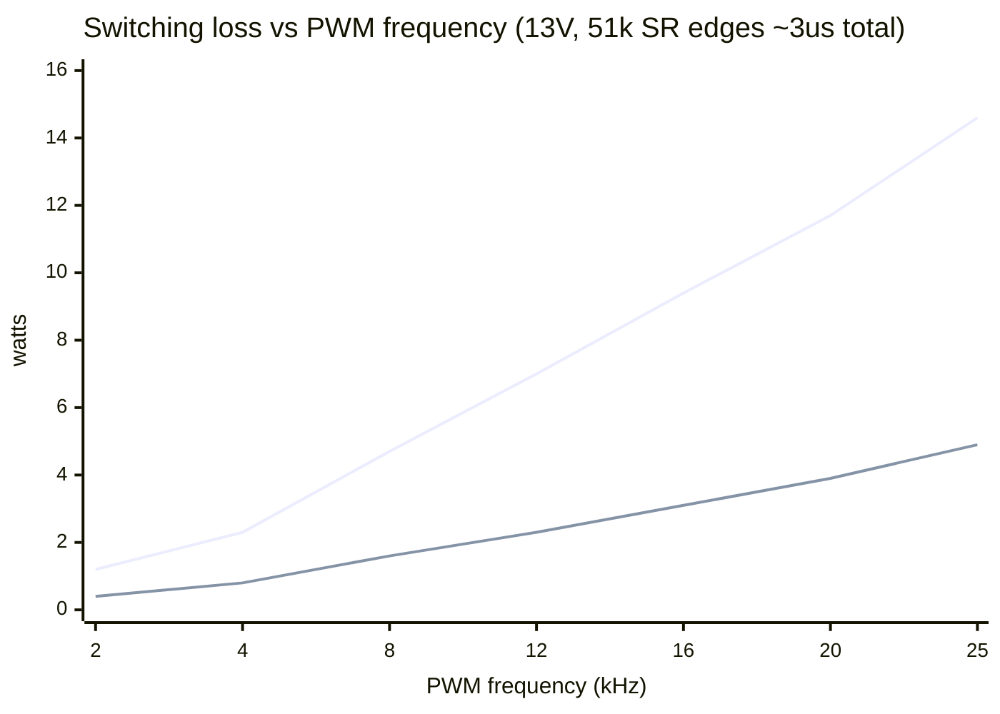
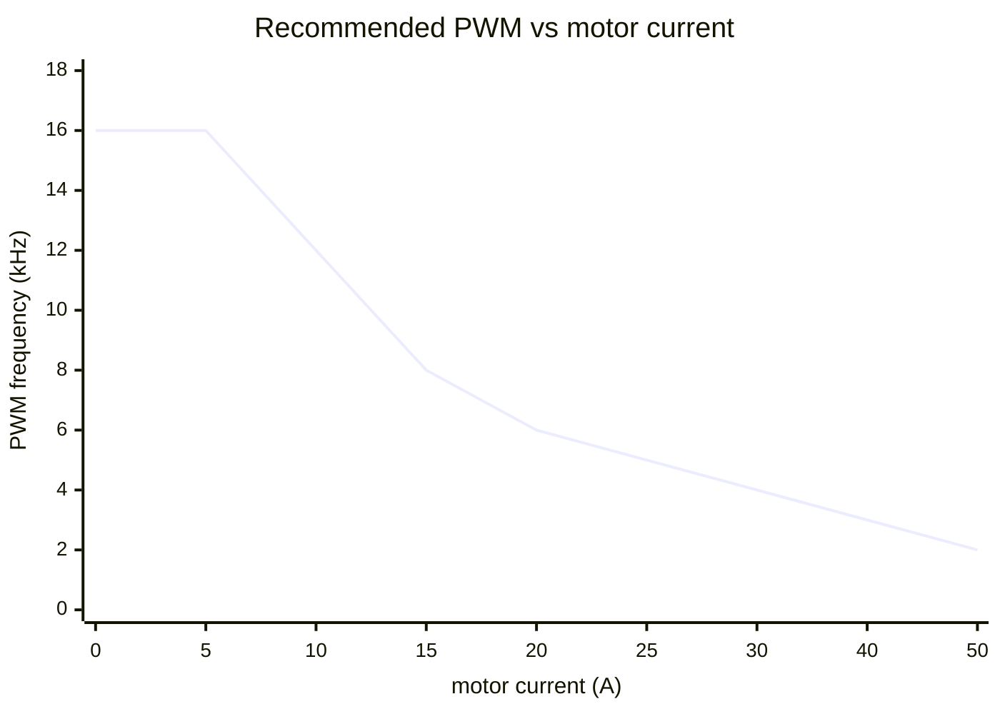

# vanchor-thrust — trolling-motor DC driver

95×92 mm 2-layer board. Full H-bridge for a 12–24 V brushed trolling motor,
controlled by the vanchor-helm board over one straight 8-wire cable. Two
build variants share the same PCB:

| Variant | Fit | Continuous current |
|---|---|---|
| Base | U1 + U2 (2× BTN8982TA) | ~30 A (with cable reinforcement, see below) |
| High power | also U3 + U4 + R7 + R8 | ~50 A |

## Cable to the helm board

J1 mirrors helm J13 **pin-for-pin** — crimp a straight 8-wire cable
(0.5–1 mm², keep it under ~2 m, twist RPWM/LPWM with GND spares if longer):

| Pin | Signal | Direction |
|---|---|---|
| 1 | RPWM | helm → driver |
| 2 | LPWM | helm → driver |
| 3 | R_EN | helm → driver |
| 4 | L_EN | helm → driver |
| 5 | R_IS (current sense A) | driver → helm |
| 6 | L_IS (current sense B) | driver → helm |
| 7 | +5V (logic, from helm buck) | helm → driver |
| 8 | GND | — |

The LED (D1) lights when the helm's 5 V arrives — a quick cable check.

## Power wiring

M5 lugs: BATT+ / BATT− on the left edge, MOT A / MOT B on the right.
Use 10 mm² (8 AWG) or thicker cable for the 50 A build. **Fuse the battery
lead externally** (ANL or MIDI, 40 A base / 60 A high power) close to the
battery. There is **no reverse-polarity protection** — double-check
polarity before connecting; reversed battery destroys the BTN8982s.
D2 (SMCJ33A) clamps inductive spikes; the board is 12–24 V only.

## Solder-lane reinforcement (required above ~15 A continuous)

The board is ordered in standard 1 oz copper — cheap, but the copper alone
won't carry 30–50 A. Every power lane (VBAT band + spine, MOT A, MOT B on
top; GND band on the bottom) has an exposed solder lane (no solder mask).
Before first high-power use:

1. Clean the lanes with IPA, apply flux.
2. Tin each lane with a wide tip.
3. Lay 4–10 mm² desoldered copper braid or stripped solid wire along the
   lane and solder it down continuously end-to-end.

With braid on all lanes the base build handles ~30 A continuous, the
high-power build ~50 A. The 202 "solder mask bridge" DRC warnings are these
lanes — intentional.

## Firmware note (high-power variant)

Each BTN8982's IS pin sources I_load/kILIS (~8500). Both devices of a side
feed the **same** 1 k sense resistor, so with U3/U4 fitted the sensed
voltage per ampere stays the same only if the halves share evenly — in
practice treat the effective kILIS as ~22700 (verify datasheet 5.4.7) with U1/U2 only and ~17000 per
device (halved reading) when paralleled. Calibrate `THR_IS` scaling in the
Pico firmware after choosing the variant.

## NMEA2000 smart-node option (v1.1 provision, all DNP)

The board carries unpopulated through-hole provision to become a
standalone NMEA2000 node — same pattern as the helm board:

- **U5** Pico 2 (GP12-15 wired in parallel with J1's RPWM/LPWM/R_EN/L_EN,
  GP26/27 read the IS sense via R12/R13 1k series, GP18/19 run CAN via
  can2040 — identical GPIO map to the helm Pico, so the thrust firmware
  ports directly).
- **U6** SIP-3 5V regulator: R-78E5.0-0.5 for 12V boats; fit the wide-input
  **R-78HE5.0-0.5** on 24V boats (the plain R-78E tops out at 28V in, too
  close to a charging 24V bank).
- **J6** 4-pin CAN header: 3V3 / GND / TX / RX to a Waveshare SN65HVD230
  transceiver module; CAN_H/L go to the module's screw terminal.
- **J7** XH-3 lands the N2K drop cable's V+ / GND / SHIELD. R10 (0R DNP)
  optionally feeds the backbone from VBAT (fuse the drop cable); R11
  (0R DNP) bonds shield to GND at this node only if nowhere else does.

Dumb mode (default): populate nothing, drive via the J1 cable as before.
Smart mode: fit U5 + U6 + R12 + R13 + transceiver, **leave J1
unconnected** (both would drive the same nets), and implement a command
watchdog in the node firmware (hard-stop to neutral if the command PGN
stream halts >300-500 ms). ADC note: in normal operation the IS voltage
across the 1k loads stays under ~2.2V at 50A (kILIS 22.7k), but in FAULT
the IS pin sources mA-class current and the node's only protection is the
R12/R13 series resistance - fit them as 10k (not 1k) when populating the
node, or add BAT54S clamps to 3V3 like the helm board has.

## PWM frequency (firmware guidance)

The BTN8982TA allows up to 25 kHz, but this board fits **51 k slew-rate
resistors** (low-EMI edges, ~1.5 us each), so switching loss — not the
chip rating — sets the practical limit. Loss per edge scales with both
current and frequency; conduction loss at 30 A is only ~6 W, so high-kHz
PWM at high current quickly dominates the thermal budget:

*[static SVG](../../docs/diagrams/pwm-loss.svg)*

**Recommended scheme: current-adaptive PWM.** Run high frequency where it
is silent *and* cheap (low current), ramp down as current rises so the
bridge stays efficient exactly when the prop is loud enough to mask the
hum:

*[static SVG](../../docs/diagrams/pwm-schedule.svg)*

Implementation notes (RP2350, applies to the helm Pico driving this board
over J13 and to the on-board smart-node Pico alike):

- **Switch on measured current (IS), not throttle** — switching loss
  scales with amps. Use ~2 A hysteresis, or blend continuously per the
  curve above (nicer: the whine fades instead of stepping).
- **Glitch-free frequency changes**: change the PWM slice's wrap (TOP)
  value and rescale the compare level by the same ratio in the same
  update; both latch at the wrap boundary, so duty is preserved and the
  motor never feels a step.
- **Resolution is never the constraint**: 150 MHz / 16 kHz is still >13
  bits of duty resolution.
- **IS sampling**: if sampling mid-on-time, recompute the sample point
  when the wrap changes — or use the RC-averaged reading scaled by duty
  (frequency-agnostic; the helm's 20k + 100n chain does this).
- If the bridge runs warm at partial throttle, lower the 16 kHz band's
  ceiling (~10 A -> ~6 A) before touching hardware. If you truly need
  15-25 kHz at full current, swap R3/R4 (R7/R8) from 51 k to ~5.1 k —
  ~10x less switching loss, more EMI ringing; they are through-hole for
  exactly this experiment.

## Assembly order

1. SMD: BTN8982s (U1/U2, plus U3/U4 for high power), D2.
2. Resistors: R1–R6, R9 (+ R7/R8 with U3/U4), diode D1.
3. C3/C4 ceramics, C5 film, then C1/C2 electrolytics (mind polarity).
4. Lugs J2–J5, header J1.
5. Solder-lane braid (see above), then bolt to a heatsink/baseplate through
   the two M3 holes with a thermal pad under the BTN tabs for >20 A use.

## Ordering

Same fab spec as the helm board: 2 layers, 1.6 mm FR-4, 1 oz copper,
HASL, 5/5 mil, 0.3 mm min drill, tented vias. Upload
`fab/vanchor-thrust-gerbers.zip`. ~$10-15 for 5 pcs at PCBWay/JLC.

## Design notes / DRC deviations

- `solder_mask_bridge` warnings (~200): intentional exposed solder lanes.
- `pth/npth_inside_courtyard`, `courtyards_overlap`: warnings only, from
  the lug/cap density; verified manually.
- `solder_mask_bridge` is set to *ignore* in the project (the exposed
  solder lanes intentionally span nets' mask apertures).
- The routed .kicad_pcb includes hand-placed link tracks and via-hops for
  the DNP-pair nets (RPWM/LPWM/R_EN/L_EN/R_IS/L_IS between U1/U2 and
  U3/U4) — regenerating the board from `scripts/build_board.py` requires
  re-running freerouting **and** re-applying equivalent patches; treat the
  checked-in board file as the source of truth.
