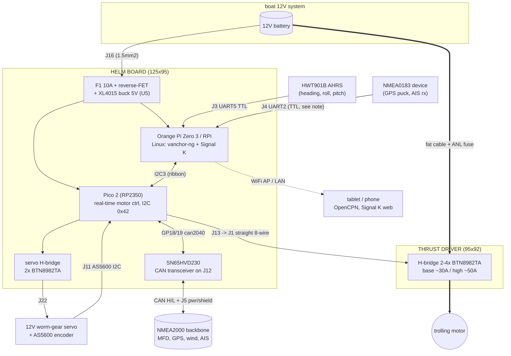
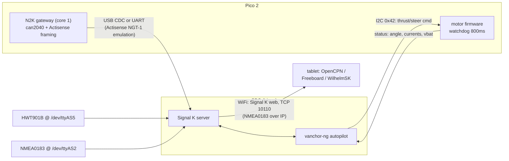
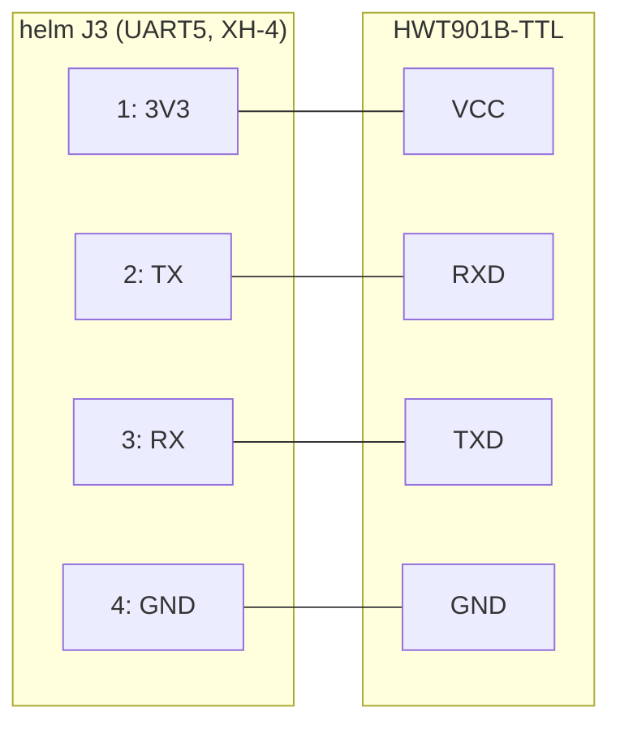
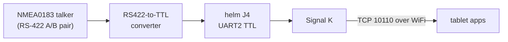
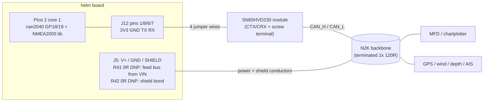
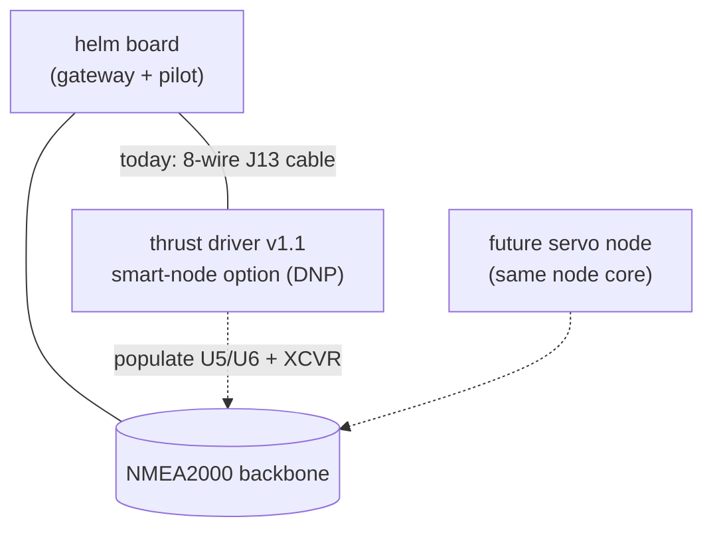
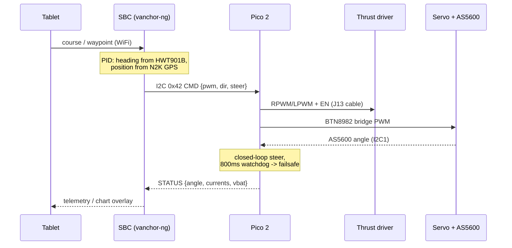

# Vanchor system architecture

How the boards, sensors, networks and the tablet fit together.
(All diagrams are Mermaid — GitHub renders them inline.)

## System overview

Two supply domains, deliberately separate: the helm board takes a fused
1.5 mm² feed for logic + servo (≤10 A), while the motor current
(30–50 A) runs battery → thrust driver → motor on fat lugged cable and
never touches the helm board.

## Software / data flow to the tablet

The Zero 3's on-board WiFi runs as an access point (hostapd + dnsmasq) or
joins the boat's network; the tablet needs nothing but a browser or a
chartplotter app pointed at the Signal K/NMEA-over-TCP port.

## HWT901B attitude sensor (heading source)

The WitMotion HWT901B-TTL (9-axis AHRS + barometer, Kalman-filtered
roll/pitch/yaw) connects to **J3 (UART5)** with a 4-wire cable:

| J3 pin | Net | HWT901B pin |
|---|---|---|
| 1 | 3V3 (from SBC) | VCC (3.3–5 V) |
| 2 | UART5_TX (SBC out) | RXD |
| 3 | UART5_RX (SBC in) | TXD |
| 4 | GND | GND |

Notes: default 9600 baud (raise to 115200 with WitMotion's config tool);
enable the `uart5` DT overlay → `/dev/ttyAS5`. **Mount the sensor ≥30 cm
from the servo/thrust cables and the motor**, level, bow-aligned, and run
a magnetometer calibration after installation — heading is the autopilot's
primary feedback. Signal K ingests it via the witmotion plugin (or
vanchor-ng reads it directly).

## NMEA0183 (v2 of NMEA — serial sentences)

J3/J4 are **3.3 V TTL** UARTs. Hobby-grade GPS pucks and AIS receivers
with TTL outputs connect directly (J4 shown; enable `uart2` overlay,
`/dev/ttyAS2`; if silent, swap TX/RX at the JST — documented hedge).
A *standards-compliant* NMEA0183 device talks RS-422 differential — put a
small RS422↔TTL (or MAX3232 for RS-232 talkers) converter in the cable:

Outbound NMEA0183 (to a VHF with DSC, etc.) works the same way in
reverse; Signal K converts between 0183 sentences, N2K PGNs and its own
model, so the tablet sees one unified feed.

## NMEA2000 (v3 of NMEA — CAN bus)

CAN lives on the **Pico 2** (can2040 PIO CAN, 250 kbit/s, core 1), not on
the Linux SBC — the bus keeps its address claim and the motor watchdog
even if Linux reboots. Hardware on the helm board:

The Pico emulates an **Actisense NGT-1** over USB-CDC (or a UART jumper
J4↔J12 GP0/GP1), so Signal K/canboat/OpenCPN consume the bus with zero
custom drivers. Outbound, the autopilot broadcasts heading (127250),
rudder (127245) and the standard thruster PGNs (128006–128008); anything
vanchor-specific rides proprietary PGNs.

**Future smart nodes**: the thrust driver already carries DNP provision
(Pico 2 + regulator + the same transceiver hookup on J6, N2K power on J7)
to hang directly on the backbone and take commands as proprietary PGNs —
see `boards/thrust-driver/README.md`. A dedicated servo node would reuse
the same node core.

## Steering / thrust control loop

Failsafe chain: if the I²C command stream stops for 800 ms the Pico zeroes
thrust and holds steering (the worm gear self-locks); if the Pico resets,
100 k pulldowns on every EN pin keep both bridges disabled.
