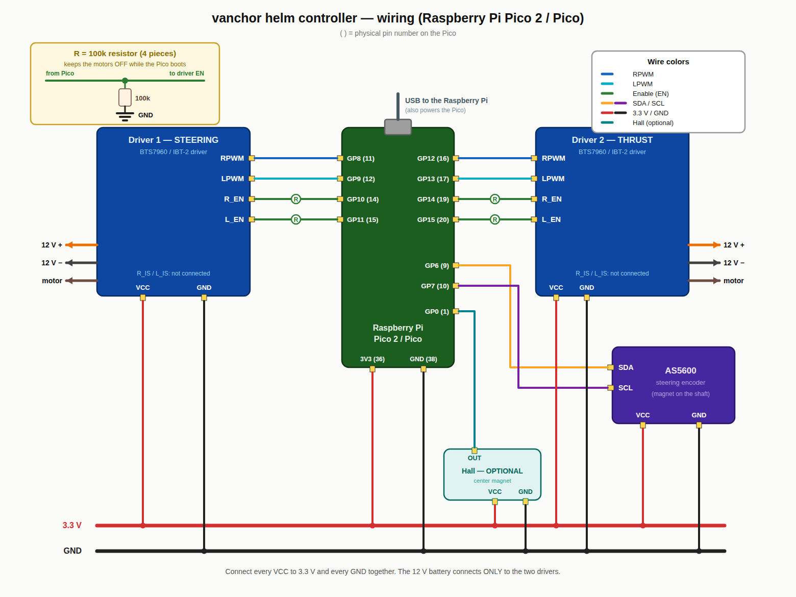

# vanchor helm-board Pico 2 firmware

One RP2350 replaces both vanchor-ng Arduinos: **engine** (thrust, via the
companion BTN8982 driver board on J13) and **steering** (on-board BTN8982
bridge, AS5600 azimuth encoder, hall zero index) speaking the vanchor-ng
line protocol **unchanged** on two equivalent transports:

- **USB-CDC** — plug-compatible with the existing Pi stack, zero code changes.
- **I²C slave 0x42** on the SBC ribbon — the same bytes through a small
  FIFO register map, so the boat needs no USB cable. Wire spec + a complete
  Pi-side implementation guide: **`docs/I2C-TUNNEL.md`** (the Pi side needs
  one new transport class in vanchor-ng; nothing above it changes).

NMEA2000 (GP18/19) is deliberately not included yet.

## Protocol (the contract)

Vendored verbatim from vanchor-ng in `vendor/` (see `vendor/README.md`):

| Direction | Line | Notes |
|---|---|---|
| Pi → Pico | `CMD <pwm> <dir> <steer> [<seq>]*HH` | combined thrust + steering (the default) |
| Pi → Pico | `STEERD <deg> [<seq>]*HH` | v2.1 degrees-native steering |
| Pi → Pico | `THRUST <pwm> <dir> [<seq>]*HH` | split thrust channel |
| Pico → Pi | `A <angle_deg> <ok> <wrap_pct> <seq>*HH` | ~10 Hz steering feedback |
| Pico → Pi | `E <pwm> <dir> <state> <seq>*HH` | ~5 Hz engine status (`RUN/SOFTSTART/REVDELAY/FAILSAFE`) |

CRC-8 (`*HH`) on every line, both directions; CRC-less commands are rejected
(build with `-DVANCHOR_REQUIRE_CRC=0` to tolerate an old Pi). `<steer>`
±100 maps to ±180° (`STEER_FULL_SCALE_DEG`), soft endstops at ±360°
(`STEER_RANGE_DEG`) — identical numbers to `steering.ino`.

**Pi configuration**: point `motor_port` at this board's CDC device, e.g.

```yaml
hardware:
  motor_port: /dev/serial/by-id/usb-Raspberry_Pi_Pico*-if00   # Pico 2 enumerates as "Pico 2"
```

(baud is ignored on CDC; leave `steering_port`/`thrust_port` blank so the
combined `SerialMotorController` drives both axes through this one port.)

## Behaviour

- **Thrust** mirrors `engine.ino`: 1.0/s throttle slew, 1000 ms reverse
  dead-time interlock (must rest at zero before a direction flip), watchdog
  failsafe slews to zero without flipping. Output is the J13 bridge
  (GP12/13 PWM, GP14/15 enables) with the **current-adaptive PWM schedule**
  from `boards/thrust-driver/README.md`: 16 kHz when quiet, stepping down to
  2 kHz at full current (2 A hysteresis), retuned glitch-minimal.
- **Steering** mirrors `steering.ino`: same PID (6.0/0.8/0.6), deadband
  1.2°, stiction floor, stall detection (position + optional current), hold
  on watchdog loss (the worm self-locks). Feedback is the AS5600 on I2C1,
  unwrapped to a continuous multi-turn angle; the **hall index on GP0**
  re-zeros the angle absolutely every time the head passes centre — set
  `CONF enc.hall_deg` if your magnet isn't at dead-centre.
- **Safety chain**: 800 ms protocol watchdog → safe state; 2 s hardware
  watchdog → reboot; both bridges held disabled until the first valid
  command, and the board's 100 k pulldowns keep them disabled whenever the
  Pico is dead, rebooting or being reflashed.
- **Telemetry**: THR_IS / SERVO_IS / VBAT are sampled and filtered every
  tick (used for the PWM schedule and stall trip). Scale constants in
  `include/board.h` carry CALIBRATE notes — verify against a clamp meter.

## Runtime configuration (CONF)

Every tuning value in `include/board.h` below the "steering tuning" line is
a **default**, not a constant: the live values sit in a config struct you
can change over the same serial port, and optionally persist to the last
4 kB sector of the Pico's flash. Commands follow the normal line rules
(CRC-8 `*HH` suffix required unless built with `VANCHOR_REQUIRE_CRC=0`);
they do **not** feed the 800 ms motor watchdog and do not participate in
the heartbeat, so config chatter can never keep an otherwise-dead link
looking alive.

| Command | Effect |
|---|---|
| `INFO*HH` | identity / versions / health snapshot (`I ...` lines) |
| `CONF <key> <value>*HH` | set in **RAM only** — reverts on reboot |
| `CONFW <key> <value>*HH` | set in RAM **and** persist *that one key* to flash |
| `CONFSAVE*HH` | persist the **whole active config** to flash |
| `CONFDUMP*HH` | list every key: `C <key> <ram_value> <stored_value>` |

`INFO` (`INFO*58` on the wire) answers six `I` lines — firmware git version, protocol
settings, config/flash state, I²C tunnel state, uptime/VBAT/angle:

```
> INFO*58
< I fw v1.2-3-gabc123 board helm-4.2 mcu pico2*..
< I proto 2.1 crc 1 wdog 800*..
< I conf 1 keys 23 flash stored*..        ("defaults" = no valid image)
< I i2c 0x42 v1 active 0*..
< I up 7423 vbat 12.6 ang -3.2 fb 1*..
< I end 5*..
```

Replies to all of these are `C ...`/`I ...` lines (CRC'd), which the Pi's
lenient feedback parsers ignore by design:

```
> CONF steer.kp 8.5*85
< C ok steer.kp 8.5*..          RAM updated
> CONFW enc.invert 1*05
< C wrote enc.invert 1*..       RAM + flash (or "C clean" if flash already had it)
> CONFSAVE*9C
< C saved*..                    whole config written (or "C clean" — no diff)
< C err key <k> / C err range <k> / C err ratelimit / C err flash
```

Semantics worth knowing:

- **`CONFW` writes through only its own key.** The stored image is
  read-modify-written for that single key, so other *temporary* `CONF`
  experiments in RAM stay temporary. `CONFSAVE` is the opposite: it
  snapshots everything currently active.
- **Diff guard**: before any write the firmware serializes the would-be
  image and byte-compares it with the sector. Identical → no erase, no
  program, reply `C clean`. Saving an unchanged config costs zero wear.
- **Rate limit**: writes are refused (`C err ratelimit`) within 2 s of the
  previous write — a stuck script cannot chew through the flash.
- **Validation**: each key has a hard range (`src/config.h`); out-of-range
  or non-numeric values are rejected wholesale (`C err range`), never
  clamped, so a typo can't half-apply. The same validation runs when
  loading from flash, so a corrupted value can never boot into the loop.
- **Integrity**: the stored image is magic + version + count + CRC32. Any
  mismatch at boot → factory defaults (fail-safe, visible in `CONFDUMP`).
  The layout is append-only: new keys go at the end, so an image saved by
  older firmware still loads with defaults for the missing tail. A
  `CONF_VERSION` bump discards stored config entirely.

Keys (see `src/config.h` for ranges): `steer.kp/ki/kd/ilim/db/minpwm/
maxpwm/range/fullscale/stall_err/stall_move/stall_ms/stall_a/recenter`,
`enc.invert/gear/hall_deg`, `thr.slew/rev_ms/hyst_a`,
`cal.thr_vpa/srv_vpa/vbat`.

All of this works identically over the I²C tunnel — `CONF*` lines and
`C ...` replies are transport-agnostic (see `docs/I2C-TUNNEL.md` §3 for the
one nuance: drain promptly after `CONFDUMP`, its ~750 B burst is most of
the tunnel's TX FIFO).

Generating the CRC for hand-typed commands: any of the OK vectors in
`vendor/protocol_vectors.txt` shows the format; quickest is
`python3 -c "import sys;l=sys.argv[1];c=0
for ch in l.encode():
 c^=ch
 for _ in range(8):c=((c<<1)^7)&0xFF if c&0x80 else (c<<1)&0xFF
print(f'{l}*{c:02X}')" 'CONF steer.kp 8.5'` — or build the bench binary with
`VANCHOR_REQUIRE_CRC=0` and skip suffixes entirely.

### ⚠ Why writing to flash is rationed

The RP2350 executes code from external **NOR flash** (W25Q-class). That
matters twice:

1. **Wear.** NOR flash erases in 4 kB sectors and each sector is only
   rated for ~100 000 erase cycles. There is **no wear levelling** in this
   scheme — every save erases the *same* sector. 100 k sounds like a lot:
   saving once a minute, around the clock, kills the sector in ~10 weeks;
   a bug that calls `CONFSAVE` at the 10 Hz command rate destroys it in
   **under 3 hours**. Hand-tuning sessions are harmless (even 50 saves a
   day is 5+ years), but *never* automate periodic saves. The diff guard
   and the 2 s rate limit are backstops, not an invitation — a value that
   genuinely changes every save (e.g. persisting a live measurement) would
   sail straight through the diff guard. Past the rating, sectors fail as
   silent bit-rot; the CRC turns that into "boots with defaults", which is
   safe but means your calibration silently vanishes.
2. **The write stalls the firmware.** During the sector erase + program
   (tens of milliseconds) the flash chip cannot serve code, so the
   firmware runs the write from RAM with **interrupts off**: the control
   loop freezes, hall edges are missed, USB traffic queues. The PWM
   hardware keeps running at the last duty, and both watchdogs comfortably
   cover the pause, but the steering PID is open-loop for that window —
   so save at the dock, not mid-manoeuvre. A power cut exactly during the
   erase window corrupts the sector; the CRC catches it at next boot and
   you fall back to defaults (another reason `CONFDUMP`'s stored column
   exists: verify after saving).

Practical rule: tune with `CONF` (free, unlimited), persist once with
`CONFSAVE` when the boat feels right, confirm with `CONFDUMP`.

## Building

Requires the [pico-sdk](https://github.com/raspberrypi/pico-sdk) **2.0+**
(unconditionally — `pico_i2c_slave` first shipped in 2.0.0) and
`gcc-arm-none-eabi`:

```sh
export PICO_SDK_PATH=~/pico-sdk        # or -DPICO_SDK_FETCH_FROM_GIT=on
cmake -B build -DCMAKE_BUILD_TYPE=Release
cmake --build build -j
# -> build/vanchor_helm_pico.uf2 / .elf
```

CMake options: `-DPICO_BOARD=pico` targets an original RP2040 Pico (see
below); `-DVANCHOR_REQUIRE_CRC=0` builds the CRC-tolerant bench variant
(this is a real cache option wired to the compiler — no CXX_FLAGS tricks).

## Bare Pico / DIY build (no vanchor PCB)



*( ) = physical pin number on the Pico. The yellow box shows how each of the
four 100 k EN pulldowns connects. Generated by
[`docs/wiring/gen_wiring.py`](docs/wiring/gen_wiring.py) — edit that, not the
image.*

The firmware runs on a plain **RP2040 Pico or Pico 2** with two IBT-2 /
BTS7960-style H-bridge modules and an AS5600 breakout — the PWM tick is
derived from `clk_sys` at boot, so both chips get correct frequencies.

```sh
cmake -B build -DPICO_BOARD=pico \
  -DCMAKE_CXX_FLAGS="-DPIN_LED_STAT=25"   # onboard LED on a bare Pico
```

Every pin and default in `include/board.h` is `#ifndef`-guarded, so override
whatever differs from the PCB the same way (`-DPIN_SRV_RPWM=2 ...`). Default
wiring (BTS7960 naming): servo bridge RPWM/LPWM = GP8/GP9, R_EN/L_EN =
GP10/GP11; thrust bridge RPWM/LPWM = GP12/GP13, R_EN/L_EN = GP14/GP15;
AS5600 SDA/SCL = GP6/GP7 (breakouts carry their own pull-ups); optional hall
zero on GP0 (internal pull-up enabled); optional SBC I2C tunnel on GP4/GP5.

Two hardware notes that the firmware cannot cover for you:

- **Add a physical ~100 k pulldown on all four EN pins.** During reset,
  BOOTSEL and reflash the Pico's pins float, and IBT-2 modules do not
  guarantee their own pulldowns — without resistors the bridges can float
  enabled while the firmware is not running. The vanchor PCB has them; a
  breadboard build must too.
- BTS7960 current sense scales differently from the PCB's BTN8982
  (kILIS ≈ 8500 vs 22700): calibrate `cal.thr_vpa` / `cal.srv_vpa` over
  serial (`CONF`) against a clamp meter, or leave current-based stall off
  (default) and skip the IS pins entirely.

## Flashing

- **First time / no debugger**: hold BOOTSEL, plug USB, copy the `.uf2`.
- **In-circuit (assembled boat)**: SWD over the ribbon from the SBC —
  SWCLK/SWDIO land on Zero 3 pins 16/18 (PC15/PC14), RUN on pin 12:
  `openocd -f interface/linuxgpiod.cfg -f target/rp2350.cfg` (`rp2040.cfg`
  for an original Pico; pin mapping in `docs/HANDOFF.md`). Never needed for
  normal operation.

## Bring-up checklist

1. Bench-power the helm board, no props, `screen /dev/ttyACM0`.
2. You should see `A ...` at 10 Hz and `E 0 F RUN -1*..` at 5 Hz. `ok` will
   be `1` only with the AS5600 magnet in range.
3. Type `CMD 0 F 0*DC` — the enables assert (bridge LEDs / 5 V on J13.7).
4. `CMD 60 F 0*..` (compute a CRC with `tests/`, or build with
   `VANCHOR_REQUIRE_CRC=0` for the bench) — thrust ramps softly; stop
   commanding — after 800 ms the `E` state shows `FAILSAFE` and it ramps out.
5. Swing the head by hand past centre — the hall edge re-zeros `A`'s angle.
6. `STEERD 10.0*..` — the servo drives; verify +deg = starboard, else send
   `CONF enc.invert 1` (encoder) and/or swap the servo motor leads (drive).

## Tests

`make -C tests` — host-compiles the **exact** shipped headers and replays
the golden `protocol_vectors.txt` through the real accept/parse path (both
CRC modes), round-trips outbound `A`/`E` CRCs, and unit-tests the reverse
gate, slew, failsafe states, PID direction/deadband/stall and the multi-turn
unwrap. CI-friendly: exits non-zero on any failure.

## Layout

```
CMakeLists.txt, pico_sdk_import.cmake   build glue (PICO_BOARD=pico2)
include/board.h                          pin map + tuning defaults
src/main.cpp                             transports, sensors, output stages
src/control_logic.h                      hardware-free control cores
src/config.h                             CONF keys, validation, persistence
src/tunnel_core.h, src/i2c_tunnel.*      I2C tunnel (register machine + glue)
src/protocol_ext.h                       THRUST token parser (+ vendored hdr)
vendor/                                  the contract, verbatim from vanchor-ng
docs/I2C-TUNNEL.md                       I2C wire spec + Pi implementation guide
tests/                                   host test suite (no SDK needed)
```
